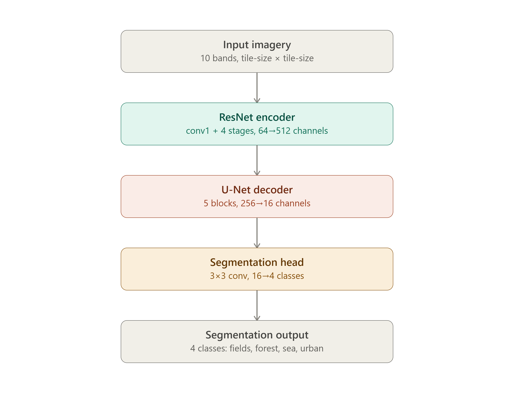

## 7A Training own CNN model

In this exercise own CNN model is trained from scratch.

## Main steps

1) Model training, including data loading and tiling with torchgeo. 
2) Predicting the classification and class-wise probabilites.
3) Evaluation of the model visually and by calculating performance metrics.

The first 2 steps are run as batch job, because GPU-resources are needed.
Below are the detailed instructions how to run the exercise.

## Model architecture

## 7A.1 Data loading and CNN model training as a batch job.
* Open these files, we will go through it in details.
    * Python code: [07A_1_train_model.py](07A_1_train_model.py)
    * HPC batch job file: [07A_1_train_model.sh](07A_1_train_model.sh)
    * No modifications are needed to the files.
* Submit Python script as SLURM batch job in a supercomputer:
    * Open Terminal to login-node: Open Tools -> Login node shell (Roihu-GPU)
    * A black window with SSH connection to Roihu opens, now Linux commands should be used.
    * The shell opens in home directory, to access the files, change working 
    directory:
        * `cd /scratch/project_2019932/students/$USER/GeoML/07_cnn_segmentation/07A_own_model_training`
    * See that you are in the right folder:
        * `ls -l`.
        * It should list the files that you see also in Jupyter File panel.
    * Submit a batch job:
        * `sbatch 07A_1_train_model.sh`
    * It outputs the job number, for example: `Submitted batch job 1212121212`
* To see the Python output file, open it with `tail`, the exact file name depends on the number printed previosly:
    * `tail -f slurm-1212121212.out`.
    * The output file includes:
        * Printout of used folders, just to double-check
        * This output file is also the first place to look for errors, when writing own scripts.
    * Optional, to see full output from beginning:
        * `less slurm-1212121212.out`
        * This does not update, if file gets more rows.
    * It is possible to see job's state (waiting, running, finished) and used resources with
        * `seff 1212121212`)
* Training takes about 5 minutes in Roihu.
* There should be new files in the `07A_own_model_training` folder:
    * `best_model.ckpt` - the trained model in `checkpoints` folder. The best model has highest number.
        *  It might be that Jupyter does not let to access the checkpoints folder, use Jupyter Terminal, Login-node shell or Files section in web interface to access it.
    *  Logs of training in `logs` folder that can be viewed using Tensorboard.

## 7A.2 Predict the classification and class-wise probabilites 
* Open these files, we will go through it in details.
    * Python file: [07A_2_predict.py](07A_2_predict.py)
    * HPC batch job file: [07A_2_predict.sh](07A_2_predict.sh)
    * No modifications are needed to the files.
* Submit Python script as SLURM batch job in a supercomputer:
    * Submit a batch job:
        * `sbatch 07A_2_predict.sh`
* 3 new files are created:
    * The predicted classification and class probabilities .tif files to [../../classification_results](../../classification_results)-folder
    * `cnn_own_model_description.txt`-file to the exercise folder, that shows the model architecture.

## 7A.3 Evaluate the model visually and by calculating performance metrics.
* Open Jupyter as described in [main Readme](../../Readme.md)
* Open [../07_3_segmentation_evaluation.ipynb](../07_3_segmentation_evaluation.ipynb) from the main folder of exerice 7.
